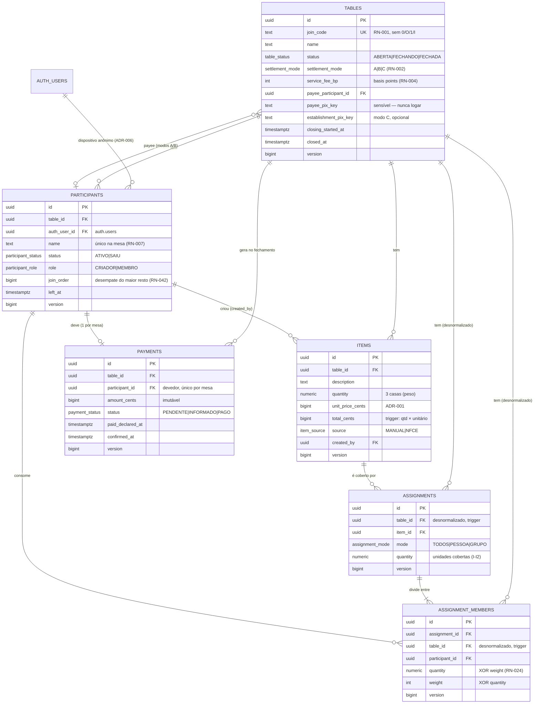

# Diagrama ER — ContaFácil

## Cardinalidades e observações

- **Mesa → Participantes**: 1‑N; exatamente **um** `CRIADOR` `ATIVO` por mesa (índice único parcial, I-M5); uma participação `ATIVO` por dispositivo por mesa (ADR-006).
- **Item → Assignments**: 1‑N; a soma de `assignments.quantity` por item nunca excede `items.quantity` (trigger diferido, I-I2).
- **Assignment → Members**: 1‑N (≥1 no commit); refinamento homogêneo (todos por quantidade ou todos por peso).
- **Mesa → Payments**: só nascem durante `FECHANDO`, no máximo um por participante (I-G1/G2).
- **Recebedor** (`payee_participant_id`): definido na criação (modo A), no fechamento (modo B) ou nunca (modo C).
- Todas as tabelas: `created_at`, `updated_at` e `version` (contador por linha, usado pela idempotência do realtime — FA-91).
