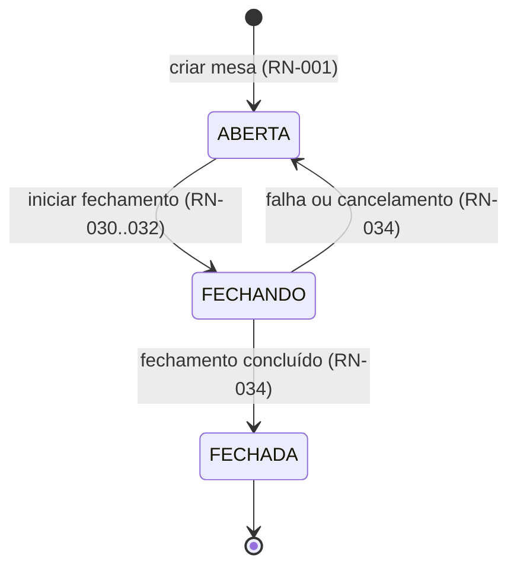
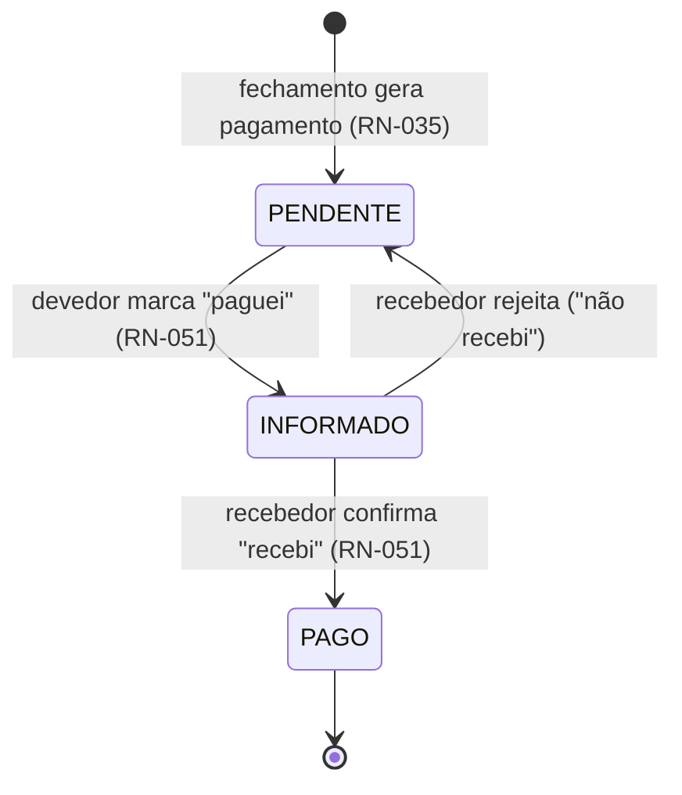
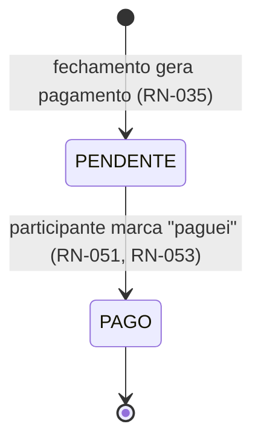
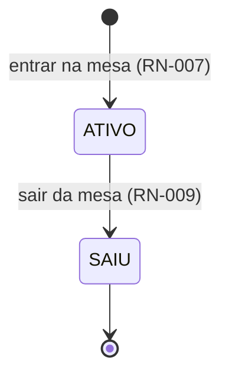

# Máquinas de Estados — ContaFácil

Três máquinas de estados regem o domínio: **Mesa**, **Pagamento** e **Participante**. Toda transição fora das listadas aqui é inválida e deve ser rejeitada em todas as camadas (UI, aplicação e banco).

## 1. Mesa

| Estado | Significado | O que é permitido |
|--------|-------------|-------------------|
| `ABERTA` | Mesa viva | Entrar/sair, criar/editar/remover itens, distribuir, configurar taxa e modo (criador) |
| `FECHANDO` | Fechamento em curso | **Nada** — mesa congelada para todos (RN-033); apenas o processo de fechamento age |
| `FECHADA` | Conta fechada (terminal) | Leitura + atualização de status de pagamentos (RN-052). Sem reabertura (RN-005 ⚠️P4) |

### Transições

| De | Para | Gatilho | Guardas |
|----|------|---------|---------|
| — | `ABERTA` | Criar mesa | Nome/config válidos; modo A exige chave PIX (RN-003) |
| `ABERTA` | `FECHANDO` | Criador inicia fechamento | ≥1 participante com consumo, ≥1 item (RN-030); itens sem dono resolvidos: dividir entre todos ou abortar (RN-032) |
| `FECHANDO` | `FECHADA` | Motor calculou e pagamentos gravados | Transação atômica completa (RN-034); invariantes RN-036 verificadas |
| `FECHANDO` | `ABERTA` | Falha em qualquer passo, ou cancelamento pelo criador antes da confirmação | Nenhum pagamento persistido; estado anterior intacto (RN-034) |

## 2. Pagamento

O pagamento nasce `PENDENTE` durante a transição `FECHANDO → FECHADA` da mesa.

### Modos A e B (recebedor no app)

### Modo C (pagamento direto ao estabelecimento)

| Estado | Significado |
|--------|-------------|
| `PENDENTE` | Gerado, aguardando pagamento |
| `INFORMADO` | Devedor declarou ter pago; aguarda confirmação do recebedor (apenas modos A/B) |
| `PAGO` | Quitado (terminal) |

Regras transversais:
- Quem marca `INFORMADO` é somente o devedor; quem confirma/rejeita é somente o recebedor.
- `PAGO` é terminal — não há estorno no MVP.
- Toda mudança propaga em tempo real (evento "Pagamento atualizado").

## 3. Participante

- `SAIU` é terminal para aquela participação (I-P2): a mesma pessoa voltando entra como novo participante (novo nome ou nome liberado? o nome de quem saiu **permanece reservado** na mesa, pois segue no resumo — a pessoa que volta escolhe outro nome).
- Ao sair, se o participante era `CRIADOR`, o papel migra na mesma operação para o ativo mais antigo (RN-008 ⚠️P2). Papel não é estado desta máquina, mas a migração é atômica com a transição.

## Relações entre as máquinas

- Pagamentos só existem se a mesa alcançou `FECHADA` (I-G1); a criação deles é parte da transação `FECHANDO → FECHADA`.
- Transições de participante (`ATIVO → SAIU`) e de itens/distribuições só ocorrem com mesa `ABERTA` (RN-006) — exceto status de pagamento, exclusivo de mesa `FECHADA`.
- Nenhum fluxo de usuário (ver `fluxos-do-usuario.md`) referencia transição fora deste documento.
